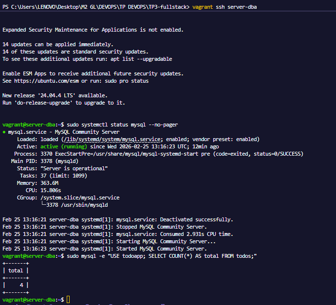
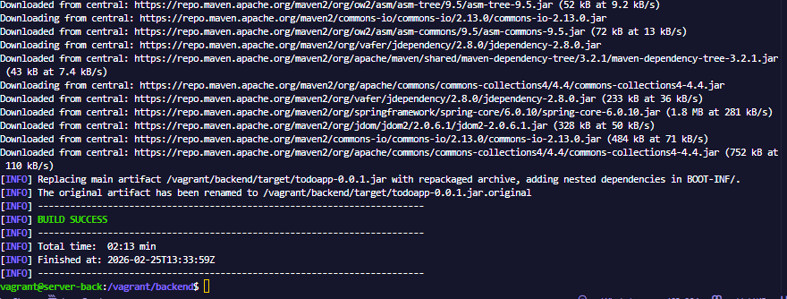
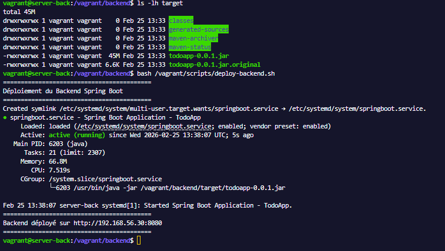
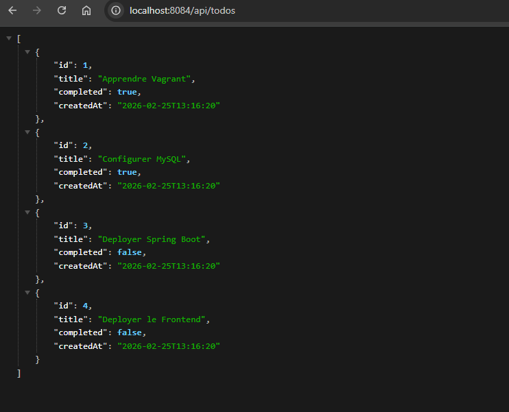
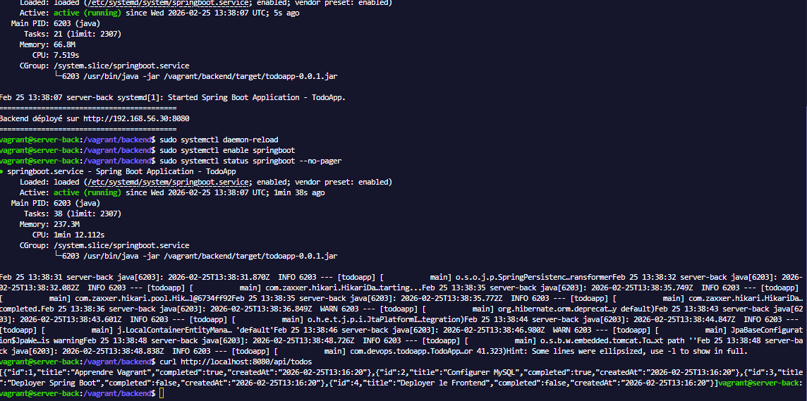
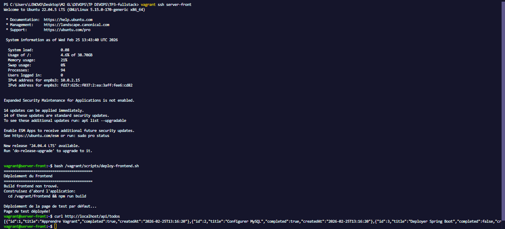
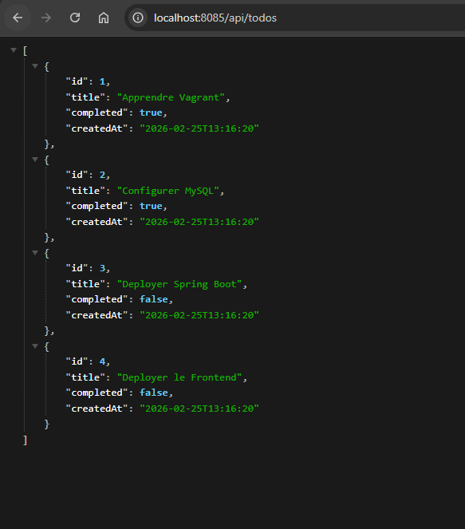
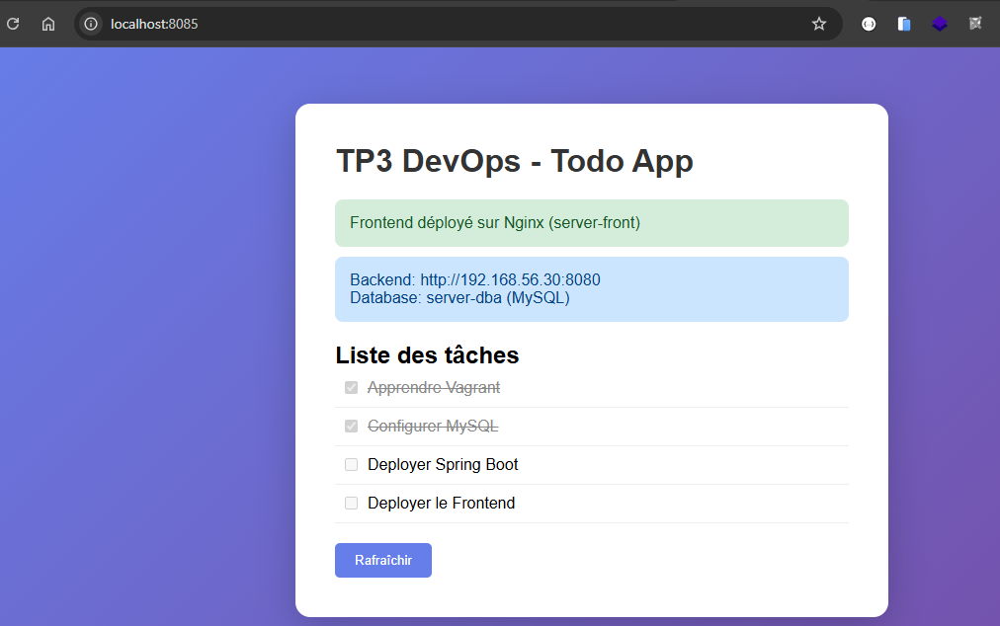

# TP3 DEVOPS - Application Full-Stack (Backend + Database + Frontend)

##  Objectif du TP

Créer une infrastructure complète à 3 machines virtuelles:
- **server-back**: Backend Spring Boot (API REST)
- **server-dba**: Base de données MySQL
- **server-front**: Frontend sur Nginx

##  Architecture

```
┌────────────────────────────────────────────────────────────────────────────────┐
│                         Réseau privé: 192.168.56.0/24                          │
│                                                                                │
│   ┌─────────────────┐      ┌─────────────────┐      ┌─────────────────┐       │
│   │   server-front  │      │   server-back   │      │   server-dba    │       │
│   │  192.168.56.32  │      │  192.168.56.30  │      │  192.168.56.31  │       │
│   │                 │      │                 │      │                 │       │
│   │  • Nginx        │ ──►  │  • Java 17      │ ──►  │  • MySQL        │       │
│   │  • Frontend     │ API  │  • Spring Boot  │ JDBC │  • todoapp DB   │       │
│   │  • Port 80      │      │  • Port 8080    │      │  • Port 3306    │       │
│   └─────────────────┘      └─────────────────┘      └─────────────────┘       │
│           │                        │                                           │
│           ▼                        ▼                                           │
│     Host:8081                Host:8080                                         │
└────────────────────────────────────────────────────────────────────────────────┘

Flux de données:
1. L'utilisateur accède au frontend (Nginx)
2. Le frontend appelle /api/* qui est proxifié vers le backend
3. Le backend Spring Boot exécute les requêtes sur MySQL
4. Les données remontent jusqu'à l'interface
```

##  Structure du projet

```
TP3-fullstack/
├── Vagrantfile                    # Configuration des 3 VMs
├── README.md                      # Ce fichier
├── scripts/
│   ├── install-java17.sh          # Installation JDK 17 (server-back)
│   ├── install-mysql.sh           # Installation MySQL (server-dba)
│   ├── install-nginx.sh           # Installation Nginx (server-front)
│   ├── deploy-backend.sh          # Déploiement Spring Boot
│   └── deploy-frontend.sh         # Déploiement du frontend
├── backend/                       # Application Spring Boot
│   ├── pom.xml                    # Dépendances Maven
│   └── src/main/java/...          # Code source Java
└── frontend/                      # (Optionnel) Application React/Angular
    └── dist/                      # Build du frontend
```

##  Comment lancer le TP

### Étape 1: Lancer les 3 VMs
```bash
cd TP3-fullstack
vagrant up
```
> Environ qlq minutes minutes pour créer et configurer les 3 VMs

### Étape 2: Construire le backend (sur votre machine hôte ou dans la VM)

**Option A: Construire sur Windows (si Maven installé)**
```bash
cd backend
mvn package -DskipTests
```

**Option B: Construire dans la VM**
```bash
vagrant ssh server-back
sudo apt-get install -y maven
cd /vagrant/backend
mvn package -DskipTests
```

### Étape 3: Déployer le backend
```bash
vagrant ssh server-back
bash /vagrant/scripts/deploy-backend.sh
```

### Étape 4: Déployer le frontend
```bash
vagrant ssh server-front
bash /vagrant/scripts/deploy-frontend.sh
```

### Étape 5: Tester
- Frontend: http://localhost:8081
- API Backend: http://localhost:8080/api/todos

##  Commandes utiles

### Gestion des VMs
```bash
vagrant up                  # Démarrer les 3 VMs
vagrant up server-back      # Démarrer seulement server-back
vagrant ssh server-back     # Se connecter à server-back
vagrant ssh server-dba      # Se connecter à server-dba
vagrant ssh server-front    # Se connecter à server-front
vagrant halt                # Arrêter toutes les VMs
vagrant destroy -f          # Supprimer toutes les VMs
vagrant status              # Voir l'état des VMs
```

### Dans server-dba (MySQL)
```bash
# Se connecter à MySQL
sudo mysql

# Voir les données
USE todoapp;
SELECT * FROM todos;

# Ajouter une tâche
INSERT INTO todos (title) VALUES ('Nouvelle tâche');
```

### Dans server-back (Spring Boot)
```bash
# Voir les logs de l'application
sudo journalctl -u springboot -f

# Redémarrer l'application
sudo systemctl restart springboot

# Tester l'API
curl http://localhost:8080/api/todos
```

### Dans server-front (Nginx)
```bash
# Voir les logs Nginx
sudo tail -f /var/log/nginx/access.log

# Recharger Nginx
sudo systemctl reload nginx
```

## Configuration

### Base de données (server-dba)
| Paramètre | Valeur |
|-----------|--------|
| Hôte | 192.168.56.31 |
| Port | 3306 |
| Base | todoapp |
| Utilisateur | springuser |
| Mot de passe | springpass |

### Ports exposés
| Service | VM | Port VM | Port Hôte |
|---------|-----|---------|-----------|
| Spring Boot | server-back | 8080 | 8080 |
| MySQL | server-dba | 3306 | 3306 |
| Nginx | server-front | 80 | 8081 |

##  Explications techniques

### Backend Spring Boot

**Structure du projet:**
- `TodoApplication.java`: Point d'entrée de l'application
- `Todo.java`: Entité JPA (correspond à la table MySQL)
- `TodoRepository.java`: Interface pour accéder aux données
- `TodoController.java`: Endpoints REST de l'API

**Endpoints de l'API:**
| Méthode | URL | Description |
|---------|-----|-------------|
| GET | /api/todos | Liste toutes les tâches |
| GET | /api/todos/{id} | Récupère une tâche |
| POST | /api/todos | Crée une tâche |
| PUT | /api/todos/{id} | Met à jour une tâche |
| DELETE | /api/todos/{id} | Supprime une tâche |

### Configuration Nginx (Proxy)

Nginx sert le frontend ET fait proxy vers le backend:
```nginx
# Fichiers statiques du frontend
location / {
    try_files $uri $uri/ /index.html;
}

# Proxy vers Spring Boot pour les appels API
location /api/ {
    proxy_pass http://192.168.56.30:8080/api/;
}
```

Cela permet au frontend d'appeler `/api/todos` sans se soucier de l'IP du backend.

### Communication entre les VMs

Les 3 VMs sont sur le même réseau privé `192.168.56.0/24`:
- Elles peuvent communiquer entre elles via leurs IPs privées
- Le pare-feu n'est pas activé (environnement de développement)

##  Points de vérification

- [ ] 3 VMs démarrées (`vagrant status`)
- [ ] MySQL actif sur server-dba
- [ ] Base `todoapp` avec données de test
- [ ] Backend Spring Boot démarré sur server-back
- [ ] API accessible: `curl http://localhost:8080/api/todos`
- [ ] Nginx actif sur server-front
- [ ] Frontend accessible: http://localhost:8081
- [ ] Frontend affiche les tâches depuis le backend

##  Dépannage

### Le backend ne démarre pas
1. Vérifier que le JAR existe:
   ```bash
   ls -la /vagrant/backend/target/
   ```
2. Vérifier les logs:
   ```bash
   sudo journalctl -u springboot -n 100
   ```
3. Tester la connexion MySQL depuis server-back:
   ```bash
   mysql -h 192.168.56.31 -u springuser -pspringpass todoapp -e "SELECT 1"
   ```

### Le frontend n'affiche pas les données
1. Vérifier que le backend répond:
   ```bash
   curl http://192.168.56.30:8080/api/todos
   ```
2. Vérifier la config Nginx:
   ```bash
   sudo nginx -t
   sudo cat /etc/nginx/sites-available/default
   ```
3. Voir les logs Nginx:
   ```bash
   sudo tail -50 /var/log/nginx/error.log
   ```

### Problème de connexion MySQL
1. Vérifier que MySQL écoute:
   ```bash
   sudo netstat -tlnp | grep 3306
   ```
2. Vérifier les droits utilisateur:
   ```bash
   sudo mysql -e "SELECT user, host FROM mysql.user WHERE user='springuser';"
   ```

## Pour aller plus loin (optionnel)

- Créer un vrai frontend React ou Angular
- Ajouter des tests automatisés
- Configurer un pipeline CI/CD avec Jenkins
- Conteneuriser avec Docker

## Captures

### Server DBA


### Server Back - Build clean install


### Server Back - Démarrage service Spring Boot


### Server Back - Résultat Spring Boot


### Server Back - Déploiement app et appel API


### Server Front - Démarrage et déploiement


### Server Front - Résultat Nginx


### Server Front - Interface HTML/CSS/JS


## Auteur

Étudiant M2 Génie Logiciel - Cours DevOps
